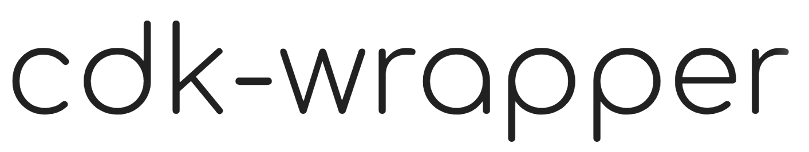

## Table of contents

- [Introduction](#Introduction)
- [Installation](#Installation)
- [Key Features](#Key-Features)
- [Usage](#Usage)
  - [Defining a State Machine using CDK Chainable API](#Defining-a-State-Machine-using-CDK-Chainable-API)
    - [From an ASL JSON File](#From-an-ASL-JSON-File)
    - [From an ASL String](#From-an-ASL-String)
    - [From a JavaScript Object](#From-a-JavaScript-Object)
- [API Reference](#API-Reference)
  - [StateMachine](#StateMachine)
    - [Static Methods](#Static-Methods)
    - [Props](#Props)
- [Advanced Features](#Advanced-Features)
  - [Extending CDK State Definitions](#Extending-CDK-State-Definitions)
- [License](#License)


## Introduction

AWS Step Functions allows you to define scalable workflows, but integrating them with different IaC frameworks can be challenging. AWS CDK simplifies the programmatic definition of state machines, but if you are already using SST, Pulumi, or others, you cannot leverage this functionality without fully adopting CDK.

`@sfn-toolbox/cdk-wrapper` decouples state machine definitions from AWS CDK, allowing them to be used independently. This way, you can define workflows without modifying your infrastructure.

## Installation

```bash
npm install @sfn-toolbox/cdk-wrapper
```

or

```bash
yarn add @sfn-toolbox/cdk-wrapper
```

## Key Features

- Programmatic definition of state machines using the AWS CDK API.
- Support for variable substitution in definitions.
- Support for multiple input formats:
  - **Chainable**: Define the workflow using code.
  - **String** and **File**: Load existing ASL definitions.
  - **Object**: Dynamically construct workflows at runtime.
- Full compatibility with Amazon States Language (ASL).

## Usage

### Defining a State Machine using CDK Chainable API

```typescript
import { StateMachine } from '@sfn-toolbox/cdk-wrapper';
import { Duration } from 'aws-cdk-lib';
import { CustomState, Succeed } from 'aws-cdk-lib/aws-stepfunctions';

const workflow = (scope: Construct) => {
  const validateFlight = new CustomState(scope, 'Validate Flight', {
    stateJson: {
      Type: 'Task',
      Resource: 'arn:aws:lambda:${region}:${account}:function:validateFlight-${stage}',
    },
  }).addRetry({
    errors: ['States.ALL'],
    interval: Duration.seconds(2),
    maxAttempts: 2,
  });

  return validateFlight.next(new Succeed(scope, 'Success'));
};

const substitutions = {
  region: 'us-east-1',
  account: '123456789012',
  stage: 'dev',
};

const stateMachine = StateMachine.fromChainable(workflow, {
  definitionSubstitutions: substitutions,
});

console.log(stateMachine.toJson()); // You can also use stateMachine.toString()
```

### From an ASL JSON File

```typescript
import { StateMachine } from '@sfn-toolbox/cdk-wrapper';

const stateMachine = StateMachine.fromFile('path/to/definition.asl.json', {
  definitionSubstitutions: {
    region: 'us-east-1',
    account: '123456789012',
    stage: 'dev',
  },
});
```

### From an ASL String

```typescript
import { StateMachine } from '@sfn-toolbox/cdk-wrapper';

const definition = `{
  "StartAt": "ValidateFlight",
  "States": {
    "ValidateFlight": {
      "Type": "Task",
      "Resource": "arn:aws:lambda:${region}:${account}:function:validateFlight-${stage}",
      "End": true
    }
  }
}`;

const stateMachine = StateMachine.fromString(definition, {
  definitionSubstitutions: {
    region: 'us-east-1',
    account: '123456789012',
    stage: 'dev',
  },
});
```

### From a JavaScript Object

```typescript
import { StateMachine } from '@sfn-toolbox/cdk-wrapper';

const definition = {
  StartAt: 'ValidateFlight',
  States: {
    ValidateFlight: {
      Type: 'Task',
      Resource: 'arn:aws:lambda:${region}:${account}:function:validateFlight-${stage}',
      End: true,
    },
  },
};

const stateMachine = StateMachine.fromObject(definition, {
  definitionSubstitutions: {
    region: 'us-east-1',
    account: '123456789012',
    stage: 'dev',
  },
});
```

## API Reference

This section describes the methods and properties available in the `StateMachine` class, explaining how to create state machines from different input formats.

### StateMachine

#### Static Methods

- `fromChainable(callback, props?)`: Creates a state machine definition from a CDK Chainable.
- `fromString(definition, props?)`: Creates a state machine definition from an ASL string.
- `fromFile(path, props?)`: Creates a state machine definition from an ASL file.
- `fromObject(definition, props?)`: Creates a state machine definition from a JavaScript object.

#### Props

```typescript
interface StateMachineProps {
  definitionSubstitutions?: Record<string, string>;
  comment?: string;
}
```

## Advanced Features

### Extending CDK State Definitions

AWS CDK's Step Functions constructs are powerful but sometimes lag behind the latest Step Functions features. The `overrideStateJson` utility allows you to extend state definitions with new features before they're officially supported in CDK.

For example, Step Functions recently introduced [Workflow Variables](https://docs.aws.amazon.com/step-functions/latest/dg/workflow-variables.html), which isn't yet supported in CDK. Here's how you can use `overrideStateJson` to add this functionality:

```typescript
import { CustomState } from 'aws-cdk-lib/aws-stepfunctions';
import { overrideStateJson } from '@sfn-toolbox/cdk-wrapper';

const validateFlight = new CustomState(scope, 'Validate Flight', {
  stateJson: {
    Type: 'Task',
    Resource: 'arn:aws:lambda:${region}:${account}:function:validateFlight-${stage}',
  },
});

// Add the Assign property for workflow variables
overrideStateJson(validateFlight, {
  Assign: {
    'validatedFlightDetails.$': '$',
  },
});
```

This results in the following ASL:

```json
{
  "Type": "Task",
  "Resource": "arn:aws:lambda:${region}:${account}:function:validateFlight-${stage}",
  "Assign": {
    "validatedFlightDetails.$": "$"
  }
}
```

The `overrideStateJson` utility is particularly useful when:

- Using new Step Functions features not yet supported by CDK
- Adding custom state properties
- Modifying state behavior without changing the original CDK construct

> **Note**: This utility should be used with caution and primarily for features that are officially supported by Step Functions but not yet available in CDK.

## License

[MIT](../../LICENSE.md)
